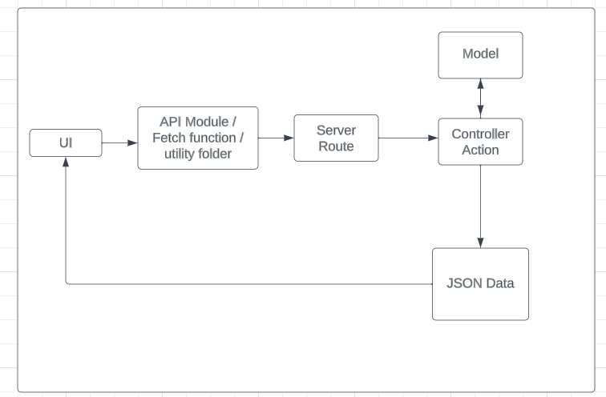
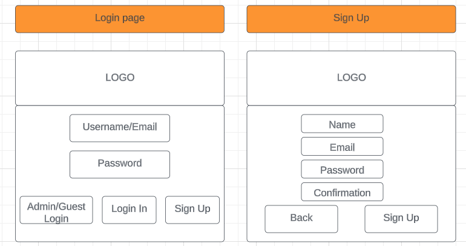
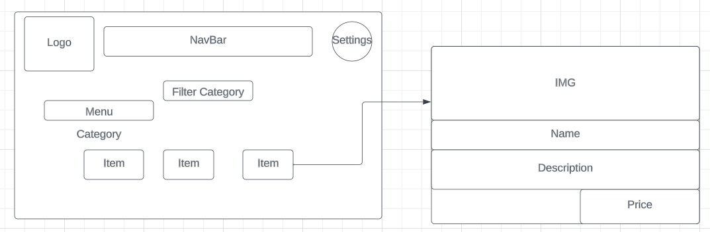
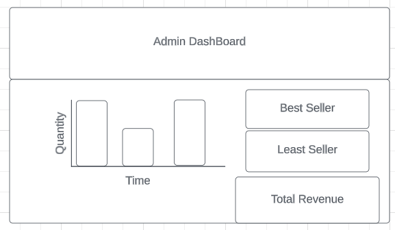
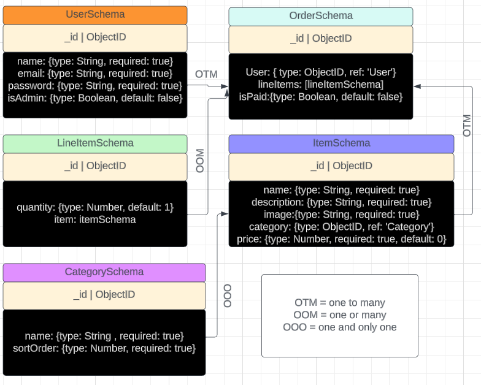

# Live Demo:
https://yourbizhere.onrender.com

# About
Template E-commerce website for business (restaurants or retail) with administrative capabilites for statistical & logistical analysis of orders and items.

# Approach
Building on top of an E-commerece market application. Users are able to Create, Update, Delete (CRUD) their accounts and make orders of items on the menu. If user has admin privilege they are able to access a dashboard (C[R]UD) graphing the orders of all users and count the items quantity. Along with some revenue and item count.

## Technology Used
- JavaScript
- React
- CSS
- MaterialUI
- MongoDB
- Express
- Node.js
- Mongoose
- Recharts
- JWT (JSON Web Token: Authorization and Authentication)
- Bcrypt (Password encrpytion, hashing and salting)

## Flow Diagram of CRUD / FULL Stack

## Wireframes

## Entity Relationship Diagram (ERD)

# Commands/Dependencies

## Front
`npm start`

## Back
`nodemon server`

## Changes run:
`npm build`

## Seed
`npm run seed`

## Secret key 
`openssl rand -hex 32`

## Recharts
`npm install recharts`

## MaterialUI
`npm install @mui/material @emotion/react @emotion/styled`

## Express
`npm i express`

## ENV (hiding mongoDB key)
`npm i dotenv`

## Mongoose
`npm i mongoose`

## React & React-DOM
`npm i react react-dom`

## Bcrypt
`npm i bcrypt`

## JWT (JsonWebToken)
`npm install jsonwebtoken`

## Morgan (logger middleware)
`npm i morgan`

## serve-favicon (middleware)
`npm install serve-favicon`

